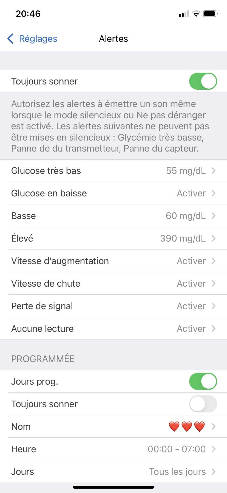

# REMINDER : take care

From my research I was able to note different tools to be remind. Some are purely technical while others are more poetic. I also realized the need of these reminders. Indeed, these reminders can be a daily need to take care of yourself. 

This is the case of the Dexcom application, an application for people with diabetes. This application calculates the glycemic index in real time and sends notifications to warn / anticipate / remind / alert / the patient. 

I would like to work on this need of reminders and their impact on the lives of patients through the example of the Dexcom application.

