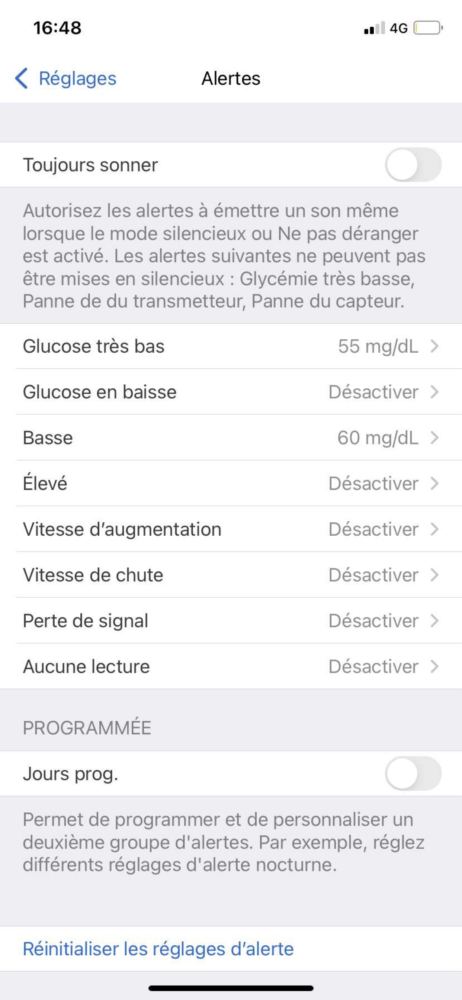

# Autonomy Tool ?

The project consists of creating a transition object connected to the dexcom application to help diabetic children (0-7 years old) to become more independent to their disease.  

This object will process the data of the application by interpreting them in a more poetic way. It is a question of moving away from the medical and scientific side to make the disease more acceptable by creating different more sensory interactions thanks to colors, textures, shapes…

