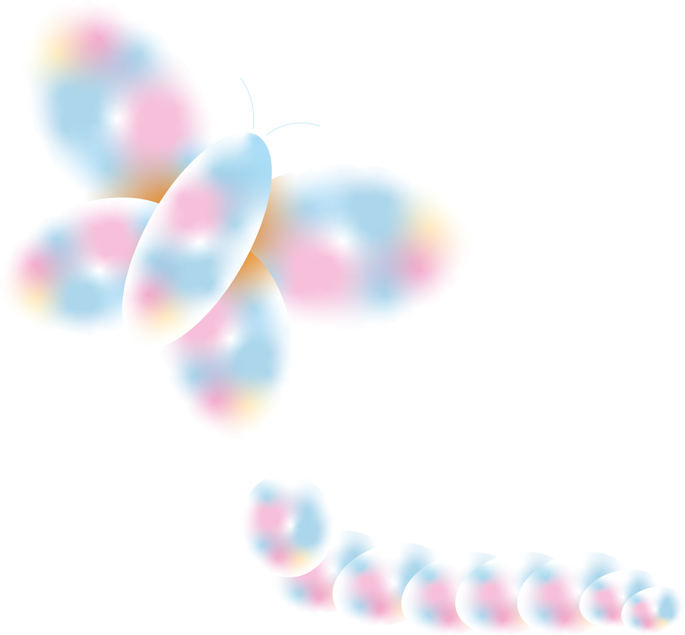

# Monarch

Based on the child's glycemic balance, the idea is to create a transition object for type 1 diabetic children.

The object is inspired by the metamorphosis between the caterpillar and the butterfly which can image the autonomy of the child.

It is about moving away from the medical and scientific side to show information through colors and emotions in order to help diabetic children become more independent in the face of their disease.

