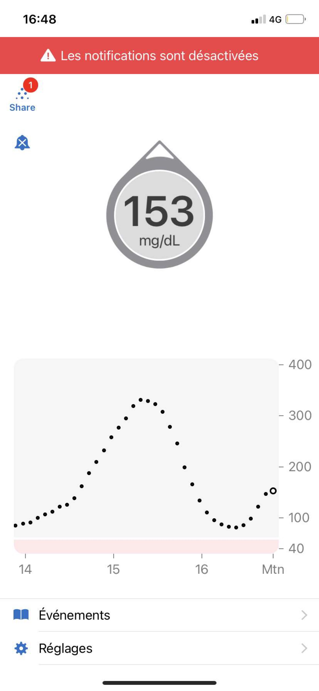
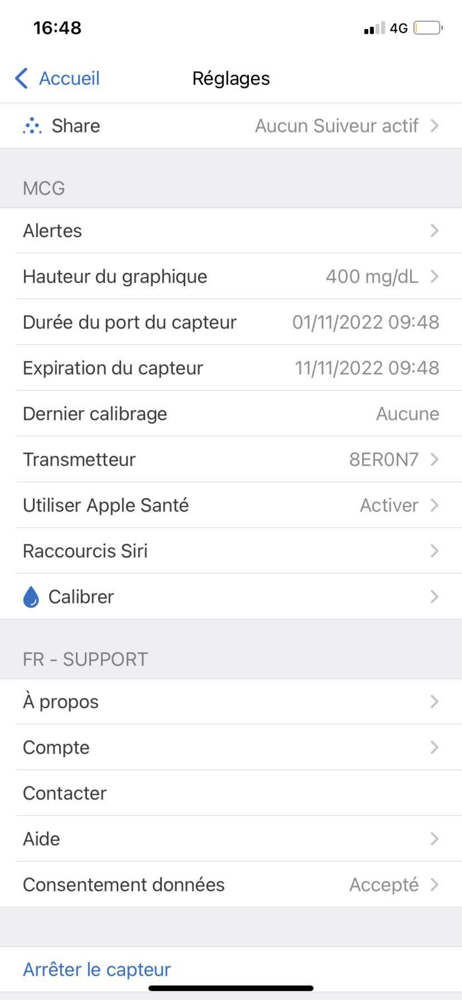

# What do you use to be remind ?

Horloge 

Telephone 

Alarm 

Montre

Photo

Post it 

Réveil 

To do list 

Objet 

Souvenir 

Time machine (serveur)

Disque dur 

Photos imprimées

Parfum 

Google calander 

alerte 

Sensoriel 

Plat que tu mangeais enfant 

Agenda papier 

Chanson

Madeleine de proust 

Apple Watch 

Application Dexcom 

Le fait de connecter un évènement a un 

Un temps lié a un événement 

Mouvement de foule pour une actions (exemple tout le monde se lève pour la pause, rappel de prendre une pause)

Lever/ coucher du soleil 

Odeur

Application note

AirTag 

Minuteur 

Carnet de note 

Notifications 

Routine 

Réseaux sociaux (actualité, trends…)

Calendrier papier 

# Reminder and gesture of a diabetic person

Vérifier sa glycémie

Compter la quantité de sucre pour la quantité d’insuline 

Poser son capteur 

Connecter le capteur

Hypoglycémie (manque de sucre dans le sang)

Hyperglycémie (excès de sucre dans le sang)

Recharger son stylo 

Insuline rapide (au repas)

Insuline lente (le soir)

Changer l’aiguille

# Lien du site de Dexcom

https://www.dexcom.com/fr-CA/applications-de-sgc

Design didactique 

Sabine, maman Designer de deux enfants diabétiques 
https://mamandesignerdunenfantdiabetique.com/category/did/

Fiche Glycemie Ecole
Cocotte d’apprentissage
Outil pour la cantine 
Did act tic tac 
#Leny (Aide aux Jeunes Diabétiques et Medtronic)

Design objet 

Stickers
Housse
Bracelet pour capteur 
Patch pour capteur 
Kit THOMY, Renata Souza 